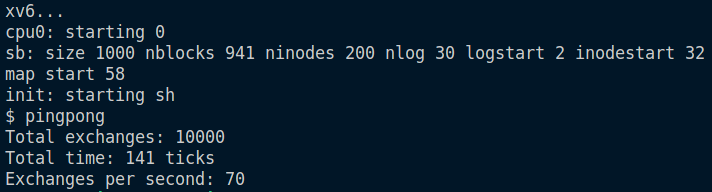
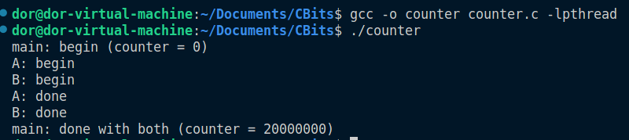

# 👾 Bit Manipulation Functions and IPC in C

This repository contains a diverse collection of C functions designed for bit manipulation, analysis, and a special feature on inter-process communication (IPC) using UNIX pipes in the xv6 environment.

- [🏓 PingPong Program](#-pingpong-program)
  - [Overview](#overview)
  - [Features](#features)
  - [How It Works](#how-it-works)
  - [Getting Started](#getting-started)
  - [Prerequisites](#prerequisites)
  - [Compilation and Execution](#compilation-and-execution)
  - [Output](#output)
- [🔒 Multi-threaded Counter with POSIX Threads](#-multi-threaded-counter-with-posix-threads)
  - [Overview](#overview-1)
  - [Features](#features-1)
  - [How It Works](#how-it-works-1)
  - [Getting Started](#getting-started-1)
  - [Output](#output-1)
  - [Note](#note)
- [Bitwise Example Program 👾](#bitwise-example-program-)
- [Count Bits Program 🧮](#count-bits-program-)
  - [How to Use](#how-to-use)
  - [Examples](#examples)
- [License](#license)


---

## 🏓 PingPong Program

### Overview

👨‍🏫 File [pingpong.c](pingpong.c) contains the PingPong program, a highlight of this repository, is an educational tool designed to demonstrate IPC using UNIX pipes in the xv6 environment. It allows two processes – a parent and a child – to communicate by "ping-ponging" a byte back and forth, providing a hands-on experience in process communication.

### Features

- **IPC Demonstration**: Showcases pipes for process-to-process communication.
- **Performance Metrics**: Outputs the performance of IPC in terms of exchanges per second.
- **Educational Tool**: Perfect for teaching operating systems and process communication.

### How It Works

🔍 The program creates two processes using `fork()`. Each process:

1. Closes its standard input (STDIN) or standard output (STDOUT).
2. Redirects STDIN or STDOUT to the ends of the pipes.
3. Executes write and read operations to exchange a byte.
4. Toggles the byte value at each exchange using XOR.

### Getting Started

### Prerequisites

- xv6 Operating System environment.
- C compiler (like `gcc`) for xv6.

### Compilation and Execution

Compile the program by adding [pingpong.c](pingpong.c) to the xv6 source file, updating the Makefile, and then compiling xv6. Execute the program from userspace via the xv6 shell.

### Output

📈 The program outputs the total number of exchanges, total time in ticks, and exchanges per second.



---

## 🔒 Multi-threaded Counter with POSIX Threads

### Overview

🔍 This section of the repository contains a multi-threaded counter program implemented in C using POSIX threads (`pthread`). The program demonstrates the basic use of threads to perform concurrent operations on a shared resource with proper synchronization using mutexes.

### Features

- **Multi-threaded Execution**: Utilizes two threads to perform concurrent increments on a shared counter.
- **Mutex Synchronization**: Demonstrates the use of `pthread_mutex_t` to ensure safe access to the shared counter and prevent race conditions.
- **Error Handling**: Includes basic error handling for mutex initialization.

### How It Works

🔍 Each thread in the program runs a loop of 10 million iterations, incrementing the shared counter in each iteration. A mutex lock is used to synchronize access to the counter, ensuring thread-safe modification.

### Getting Started

**Prerequisites:**

- A C compiler with support for POSIX threads (like `gcc`).
- POSIX-compliant operating system (Linux, UNIX, macOS).

**Compilation:**

To compile the program, navigate to the directory containing `counter.c` and run:

```bash
gcc -o counter counter.c -lpthread
```

Execution

Execute the compiled program using:

```bash
./counter
```

### Output

📈 The program will output the start and end values of the counter, demonstrating the correct and synchronized incrementation by both threads:



### Note

This program is designed as an educational tool to understand the basics of multi-threading and synchronization in C. It's well-suited for learning purposes and can be modified for more advanced multi-threading concepts.

---

## Bitwise Example Program 👾


File [bitwise.c](bitwise.c) includes simple bitwise operations in C:

- **Bits Union**: Represents a float in binary according to IEEE 754.
- **XORing**: Swaps numbers using XOR.
- **Bit Shifting**: Shifts a number left and right by 1 bit.
- **Bit Masking**: Applies a mask to a number.
- **Bit Toggling**: Toggles a specific bit in a number.
- **Bit Setting**: Sets a specific bit in a number.

---

## Count Bits Program 🧮


File [count_bits.c](count_bits.c) offers functions for counting bits:

- **printRecursiveBits**: Recursively prints binary representation of an integer.
- **printIntBits**: Prints the bits of an int iteratively.
- **printBits**: Prints binary representation of any data type.
- **count_bits**: Counts the number of 1's in a number.
- **getSizeInBits**: Returns the size of a data type in bits.
- **count_odd_bits**: Counts the number of 1 bits in odd positions.

---

### How to Use

1. Clone the repository.
2. Navigate to the desired function's directory.
3. Compile using the included Makefile.
4. Run the executable and follow the prompts.

### Examples

[count_bits example](examples_count_bits.png)


[count_odd_bits example](examples_odd_bits.png)


---

## License

This project is licensed under the MIT License - see the [LICENSE.md](LICENSE.md) file for details.
