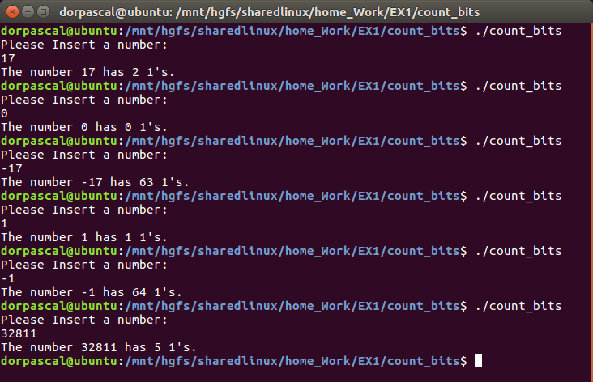
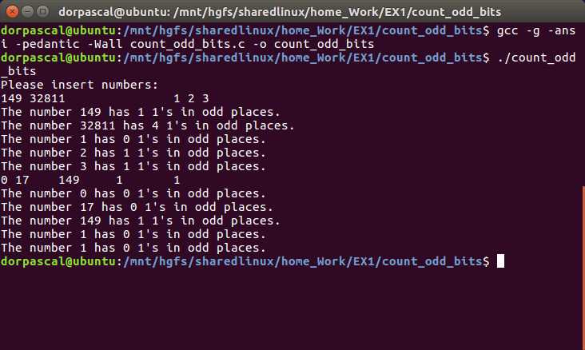

# Bit Manipulation Functions in C

This repository contains a collection of C functions designed for bit manipulation and analysis.

---

## Bitwise Example 👾

File [bitwise.c](bitwise.c) contains a simple example of bitwise operations in C, including:

- **bits union**: represents a float as its binary representation according to IEEE 754. 🌌
- **xoring**: XORs two numbers together to swap them. ↔️
- **bit shifting**: shifts a number left and right by 1 bit. ⬅️➡️
- **bit masking**: masks a number with a given mask. 🎭
- **bit toggling**: toggles a bit in a number. 🔄
- **bit setting**: sets a bit in a number. ✅

## Count Bits 🧮

File [count_bits.c](count_bits.c) contains a collection of functions for counting bits in a number, including:

🔄 printRecursiveBits

- Purpose: Recursively prints the binary representation of an integer.
- Usage: printRecursiveBits(int val, int counter);
- Details: This function uses recursion to print each bit of an integer, adding a space every 8 bits for readability.

🖨️ printIntBits

- Purpose: Prints the bits of an int.
- Usage: printIntBits(int k);
- Details: Iteratively prints each bit of an integer, one by one.

🔍 printBits

- Purpose: Prints the bits of any data type.
- Usage: printBits(void *ptr, size_t size);
- Details: Given a pointer to data and its size, this function prints the binary representation byte by byte.

📊 count_bits

- Purpose: Counts the number of bits (1's) in a number.
- Usage: count_bits(long int input);
- Details: Counts all the 1 bits in the binary representation of the given number.

📏 getSizeInBits

- Purpose: Returns the size of a data type in bits.
- Usage: getSizeInBits(unsigned short int input);
- Details: Calculates the size in bits of the given data type.

🧮 count_odd_bits

- Purpose: Counts the number of 1 bits in odd positions.
- Usage: count_odd_bits(unsigned short int input);
- Details: Specifically counts the 1 bits located in odd positions in the binary representation of the number.

## How to Use

1. Clone the repository.
2. Navigate to the directory of the function you want to use.
3. Compile the function using the included Makefile.
4. Run the executable.
5. Follow the prompts to use the function.

Enjoy!

## Example

[count_bits example](examples_count_bits.png)

[count_odd_bits example](examples_odd_bits.png)

## License

This project is licensed under the MIT License - see the [LICENSE.md](LICENSE.md) file for details
