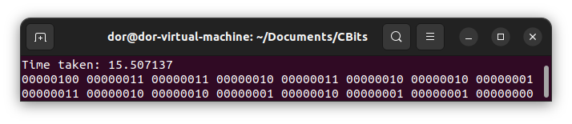

# 🔢 Embedded C Concepts

This repository contains a diverse collection of C functions, focusing on bit manipulation, memory manipulation, and a special feature on inter-process communication (IPC) using UNIX pipes in the xv6 environment.

<p align="center">
  
</p>

---

<!-- @import "[TOC]" {cmd="toc" depthFrom=2 depthTo=3 orderedList=false} -->

<!-- code_chunk_output -->

- [💾 Custom malloc \& free Implementation](#-custom-malloc--free-implementation)
  - [Overview](#overview)
  - [Key Takeaways](#key-takeaways)
- [🧬 Basice Implementation of Inheritance and Polymorphism in C](#-basice-implementation-of-inheritance-and-polymorphism-in-c)
  - [Overview](#overview-1)
  - [Features](#features)
    - [🧬 Inheritance](#-inheritance)
    - [🎭 Polymorphism](#-polymorphism)
    - [📦 Encapsulation](#-encapsulation)
    - [📞 Uniform Function Calls](#-uniform-function-calls)
    - [💾 Memory Management](#-memory-management)
    - [🔀 Type Casting](#-type-casting)
  - [Structure Overview](#structure-overview)
  - [Usage](#usage)
- [🏓 Pipes PingPong Program](#-pipes-pingpong-program)
  - [Overview](#overview-2)
  - [Features](#features-1)
  - [How It Works](#how-it-works)
  - [Getting Started](#getting-started)
  - [Prerequisites](#prerequisites)
  - [Compilation and Execution](#compilation-and-execution)
  - [Output](#output)
- [🔒 Multi-threaded Counter with POSIX Threads](#-multi-threaded-counter-with-posix-threads)
  - [Overview](#overview-3)
  - [Features](#features-2)
  - [How It Works](#how-it-works-1)
  - [Getting Started](#getting-started-1)
  - [Output](#output-1)
  - [Note](#note)
- [🧮 Count Bits Program](#-count-bits-program)
  - [Lookup Table](#lookup-table)
  - [Using n\&(n-1) algorithm of Brian Kernighan](#using-nn-1-algorithm-of-brian-kernighan)
  - [Iterative Approach](#iterative-approach)
  - [Utils Functions](#utils-functions)
  - [How to Use](#how-to-use)
  - [Examples](#examples)
- [👾 Bitwise Examples Program](#-bitwise-examples-program)
- [📚 License](#-license)

<!-- /code_chunk_output -->

---

## 💾 Custom malloc & free Implementation

### Overview

The [mymalloc.c](mymalloc.c) program is a result of my self-study following a failed interview question. It includes a custom implementation of the `malloc` and `free` functions in C, encapsulated within `mymalloc` and `myfree` wrapper functions. These functions are uniquely designed to allocate and free memory addresses aligned to specific hexadecimal increments `(0x20, 0x40, 0x60, 0x80, 0xA0, 0xC0, 0xE0, 0x00)`, or in other words, multiples of `32 bytes`.

**Update**: The program now includes an `ALIGNED_BYTES` macro, which can be used to change the alignment of the allocated memory. The program supports up to 255 bytes alignment, which fits in a single byte offset.

The offset from the original to the aligned address is stored in the byte immediately preceding the address returned by `mymalloc`.

This project was an insightful journey into pointers and memory allocation in C, spurred by my experience in an interview setting.

<p align="center">
  
</p>
<div align="center"><i>Comparing malloc and mymalloc</i></div>

---

To see an example based on 20 random size allocations, run the following command:

```bash
gcc -Wall -Wextra mymalloc.c -o mymalloc && ./mymalloc
```

to check for memory leaks, or compile it for 32-bit architecture to see the difference in memory addresses. Note that valgrind works with the 64-bit version.

```bash
gcc -m32 -o mymalloc mymalloc.c && ./mymalloc
```

```bash
gcc -o mymalloc mymalloc.c && valgrind ./mymalloc
```

<p align="center">
  
  </p>
<div align="center"><i>Valgrind output</i>
</div>

---

### Key Takeaways

1. **Pointer Arithmetic and Type Size Awareness**

    ```C
    void *wrong_mymalloc1(size_t size) {
        unsigned long long *ptr = (unsigned long long *)malloc(size + ALIGNED_BYTES);
        unsigned char offset = ALIGNED_BYTES - ((uintptr_t)ptr % ALIGNED_BYTES);
        unsigned long long *ptr2 = ptr + offset; // + how many bytes?
        *(ptr2 - 1) = offset; // Is it the byte before ptr2?
        return (void *)ptr2;
    }
    ```

    - :x: Adding `offset` to `ptr` performs arithmetic on `unsigned long long *`, resulting in an addition of `offset * sizeof(unsigned long long)` bytes, which is incorrect.
    - :white_check_mark: Perform byte-wise pointer arithmetic by casting `ptr` to `unsigned char *`. Like `unsigned char *ptr2 = (unsigned char *)ptr + offset;`

---

2. **Using Operators such as `&` and `%` with Pointers:**

    ```C
    void *wrong_mymalloc2(size_t size) {
        unsigned char *ptr = (unsigned char *)malloc(size + ALIGNED_BYTES);
        unsigned char offset = ALIGNED_BYTES - (&(*ptr) % ALIGNED_BYTES);
        unsigned char *ptr2 = ptr + offset;
        *(ptr2 - 1) = offset;
        return (void *)ptr2;
    }
    ```

    - :x: The expression `&(*ptr)` is unnecessary and incorrect.
    - :x: The code incorrectly attempts to perform modulus operation on a pointer type, which is invalid in C. Instead, the pointer should first be cast to an appropriate integer type, like `uintptr_t`, before applying the modulus operation.
    - :white_check_mark: The correct approach is to simply use `ptr` without additional dereferencing and address-of operations.
    - :white_check_mark: The corrected line should be: `unsigned char offset = ALIGNED_BYTES - ((uintptr_t)ptr % ALIGNED_BYTES);`. Additionally, there is no need for the address-of operator `&` with `ptr`, as it's already a pointer.

---

3. **Casting when Working with (void \*) Pointers:**

    ```C
    void *wrong_mymalloc3(size_t size) {
        char *ptr = (char *)malloc(size + ALIGNED_BYTES);
        char offset = ALIGNED_BYTES - ((uintptr_t)ptr % ALIGNED_BYTES);
        void *ptr2 = (void *)(ptr + offset);
        *((char *)ptr2 - 1) = offset;
        return ptr2;
    }
    ```

    - :x: The cast `(char *)ptr = (char *)malloc(...)` is syntactically incorrect. It should be `char *ptr = (char *)malloc(...)`. Additionally, arithmetic on `(void *)` pointers is not allowed in C.
    - :white_check_mark: Cast `ptr` to `char *` before performing arithmetic.

---

4. **More Points on Pointers**

    - :white_check_mark: **Always perform proper pointer initialization**: Avoid omitting the initialization of `ptr2` before dereferencing it. This could lead to undefined behavior, as the pointer could point to an arbitrary memory address.
    - :white_check_mark: **Check for malloc Failure**: Always check for `malloc` failure before proceeding with the allocation. This can be done by checking if `ptr` is `NULL` after the allocation.
    - :white_check_mark: **Avoid Dereferencing Uninitialized Pointer**: Avoid dereferencing `ptr` before it has been correctly assigned, leading to undefined behavior. The line `ptr2[-1] = offset;` is executed when `ptr2` is still `NULL`, which could likely cause a segmentation fault.
    - :white_check_mark: **Avoid Sign Overflow**: Be cautious if `char` is a signed type on some machines, which could cause an overflow when dealing with offset values greater than 127.

---

## 🧬 Basice Implementation of Inheritance and Polymorphism in C

### Overview

File [oop.c](oop.c) includes a simple implementation of OOP concepts in C. The design is inspired by the `C++` implementation of OOP, which uses structs and function pointers to achieve polymorphism.

<p align="center">
  
</p>
<div align="center"><i>Output of the OOP program</i>
</div>

---

### Features

#### 🧬 Inheritance

- Structs such as `Dog`, `Cat`, and `Labrador` are defined as extensions of the `Animal` struct, representing classical inheritance. This is achieved by embedding an `Animal` struct within each of them, allowing them to be treated polymorphically.

#### 🎭 Polymorphism

- Polymorphism is implemented via a virtual table (vtable) mechanism. Each struct has a pointer (`vptr`) to its corresponding vtable, which contains function pointers for different behaviors.

- The vtable allows objects of different types to exhibit unique behaviors, despite sharing the same base interface.

#### 📦 Encapsulation

- Behaviors of the structs are encapsulated within function pointers in the vtable. This approach hides the implementation details from the user, providing a clean interface.

#### 📞 Uniform Function Calls

- Wrapper functions like `animal_speak` provide a uniform way to invoke methods on any animal, abstracting away the complexity of direct vtable access.

#### 💾 Memory Management

- Dynamic memory allocation is used for creating instances, mimicking the object construction in OOP languages.

#### 🔀 Type Casting

- Appropriate casting is performed when derived types are treated as base types, a necessary step due to C's lack of inherent polymorphism.

### Structure Overview

- 🏗️ `struct Animal`: The base struct representing a generic animal.

- 🏗️ `struct Dog/Cat/Labrador`: Derived structs representing specific animals.

- 🏗️ `struct VTable`: A struct representing the vtable with function pointers for polymorphic behavior.

- 🏗️ `*_new` functions: Functions for creating new instances of structs.

### Usage

The main function in `main.c` demonstrates the creation of different animal types and the invocation of their behaviors.

```bash
gcc -o oop oop.c && ./oop
```

---

## 🏓 Pipes PingPong Program

### Overview

👨‍🏫 File [pingpong.c](pingpong.c) contains the PingPong program, a highlight of this repository, is an educational tool designed to demonstrate IPC using UNIX pipes in the xv6 environment. It allows two processes – a parent and a child – to communicate by "ping-ponging" a byte back and forth, providing a hands-on experience in process communication.

<p align="center">
  
</p>

### Features

- **IPC Demonstration**: Showcases pipes for process-to-process communication.

- **Performance Metrics**: Outputs the performance of IPC in terms of exchanges per second.

- **Educational Tool**: Perfect for teaching operating systems and process communication.

### How It Works

🔍 The program creates two processes using `fork()`. Each process:

1. Closes its standard input (STDIN) or standard output (STDOUT).

2. Redirects STDIN or STDOUT to the ends of the pipes.

3. Executes write and read operations to exchange a byte.

4. Toggles the byte value at each exchange using XOR.

### Getting Started

### Prerequisites

- xv6 Operating System environment.

- C compiler (like `gcc`) for xv6.

### Compilation and Execution

Compile the program by adding [pingpong.c](pingpong.c) to the xv6 source file, updating the Makefile, and then compiling xv6. Execute the program from userspace via the xv6 shell.

### Output

📈 The program outputs the total number of exchanges, total time in ticks, and exchanges per second.

<p align="center">
  
</p>
<div align="center"><i>Output of the PingPong program</i>
</div>

---

## 🔒 Multi-threaded Counter with POSIX Threads

### Overview

🔍 This section of the repository contains a multi-threaded counter program implemented in C using POSIX threads (`pthread`). The program demonstrates the basic use of threads to perform concurrent operations on a shared resource with proper synchronization using mutexes.

### Features

- **Multi-threaded Execution**: Utilizes two threads to perform concurrent increments on a shared counter.

- **Mutex Synchronization**: Demonstrates the use of `pthread_mutex_t` to ensure safe access to the shared counter and prevent race conditions.

- **Error Handling**: Includes basic error handling for mutex initialization.

### How It Works

🔍 Each thread in the program runs a loop of 10 million iterations, incrementing the shared counter in each iteration. A mutex lock is used to synchronize access to the counter, ensuring thread-safe modification.

### Getting Started

**Prerequisites:**

- A C compiler with support for POSIX threads (like `gcc`).

- POSIX-compliant operating system (Linux, UNIX, macOS).

**Compilation:**

To compile the program, navigate to the directory containing `counter.c` and run:

```bash
gcc -o counter counter.c -lpthread
```

Execution

Execute the compiled program using:

```bash
./counter
```

### Output

📈 The program will output the start and end values of the counter, demonstrating the correct and synchronized incrementation by both threads:


### Note

This program is designed as an educational tool to understand the basics of multi-threading and synchronization in C. It's well-suited for learning purposes and can be modified for more advanced multi-threading concepts.

---

## 🧮 Count Bits Program

File [count_bits.c](count_bits.c) offers basice functions to count bits in C, including a lookup table and the n&(n-1) algorithm of Brian Kernighan, and an iterative approach. The program also includes several utility functions for printing bits and counting bits in different data types, and compare the performance of each approach by calculating time / cpu cycles for each function.

<p align="center">
  
</p>
<div align="center"><i>Count Bits Program</i>
</div>

### Lookup Table

The lookup table stores the number of 1 bits in a nibble (4 bits). This allows the program to count the number of 1 bits in a number by summing the number of 1 bits in each nibble.

The index of the lookup table is the nibble itself, and the value is the number of 1 bits in that nibble. For instance, the number of 1 bits in the nibble `0b1010` (10 in 10 base) is 2, which is stored in the lookup table at index `0b1010`.

This approach is more efficient than counting the bits in each nibble individually, as it avoids the need for a loop. For even more efficiency, the lookup table can be extended to include the number of 1 bits in a byte (8 bits), or even a word (16 bits) ETC.

Full table of $n$ bits will require $2^{n}$ entries, which is $2^4$ entries for a nibble, or 16 entries. Even thogh, becuse the smallest data type in C is a byte (8 bits), the table will require 16 entries * 8 bits = 128 bits, which is 16 bytes.

A table for a word will require $2^{16}$ entries, which is 64KB without considering the data type. The size can be reduced by using a smaller data type for the table entries, such as `uint8_t` or `uint16_t`.

<p align="center">
  
</p>
<div align="center"><i>4 bit lookup table from 0 (right down) to 15 (left up)</i>
</div>

### Using n&(n-1) algorithm of [Brian Kernighan](https://en.wikipedia.org/wiki/Brian_Kernighan)

The second version of the program uses the algorithm of Brian Kernighan, which is based on the fact that `n&(n-1)` always clears the least significant bit of $n$.

For Example:

| n | 0 | 0 | 0 | 0 | 1 | 0 | 1 | 0 | 0 | 0 | 0 | 0 | 0 | 0 | 0 | 0 |
| :- | - | --- | --- | --- | --- | --- | --- | --- | --- | --- | --- | --- | --- | --- | --- | --- |
| n - 1 | 0 | 0 | 0 | 0 | 1 | 0 | 0 | 1 | 1 | 1 | 1 | 1 | 1 | 1 | 1 | 1 |
| n & (n - 1) | 0 | 0 | 0 | 0 | **1** | 0 | 0 | 0 | 0 | 0 | 0 | 0 | 0 | 0 | 0 | 0 |

The algorithm works by counting the number of times `n&(n-1)` is performed until $n$ becomes 0. The number of times the operation is performed is the number of 1 bits in $n$.

### Iterative Approach

The naive approach to counting the number of 1 bits in a number is to iterate over each bit and check if it's 1. This approach is inefficient, as it requires a loop and a conditional check for each bit.

---

### Utils Functions

The program also includes several utility functions for printing bits and counting bits in different data types.

One of the most useful functions is `printBits`, which prints the binary representation **of any data type**. This function is useful for debugging and understanding the binary representation of different data types.

```C
/* printBits: print the bits in any data type */
void printBits(void *ptr, size_t size) {
   unsigned char *bytes = (unsigned char *)ptr;
   for (size_t i = size - 1; i != SIZE_MAX; i--) {
      for (int j = 7; j >= 0; j--) {
       printf("%d", (bytes[i] >> j) & 1);
      }
      putchar(' '); // print a space after each byte
   }
   putchar('\n');
}
```

The function takes a pointer to any data type and its size in bytes. It then cast the pointer to an `unsigned char *` to allow byte-level access. It then iterates over each byte, printing its bits from the most significant bit to the least significant bit.

The program also includes the following functions:

- **printRecursiveBits**: Recursively prints binary representation of an integer.

- **printIntBits**: Prints the bits of an int iteratively.

- **printBits**: Prints binary representation of any data type.

- **getSizeInBits**: Returns the size of a data type in bits.

- **count_odd_bits**: Counts the number of 1 bits in odd positions.

---

### How to Use

1. Clone the repository.

2. Navigate to the desired function's directory.

3. Compile using the included Makefile.

4. Run the executable and follow the prompts.

### Examples

[count_bits example](examples_count_bits.png)


[count_odd_bits example](examples_odd_bits.png)


---

## 👾 Bitwise Examples Program


File [bitwise.c](bitwise.c) includes simple bitwise operations in C:

- **Bits Union**: Represents a float in binary according to IEEE 754.

- **XORing**: Swaps numbers using XOR.

- **Bit Shifting**: Shifts a number left and right by 1 bit.

- **Bit Masking**: Applies a mask to a number.

- **Bit Toggling**: Toggles a specific bit in a number.

- **Bit Setting**: Sets a specific bit in a number.

---

## 📚 License

This project is licensed under the MIT License - see the [LICENSE.md](LICENSE.md) file for details.
